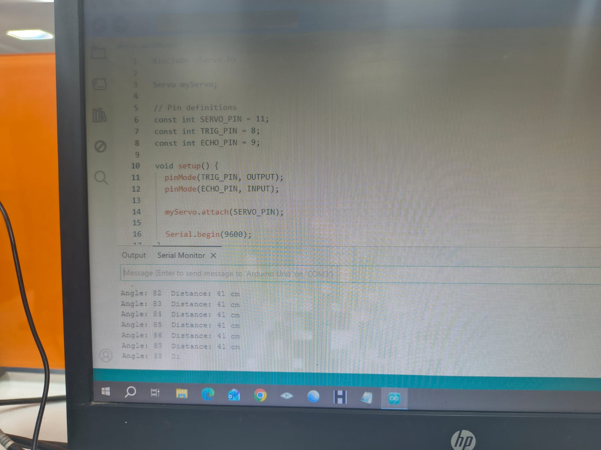

# Arduino-Ultrasonic-radar-Iot
A real-time 180-degree radar object detection system built with Arduino Uno, HC-SR04 ultrasonic sensor, SG90 servo motor, and Processing 4 GUI.
# Arduino Ultrasonic Radar System

An IoT prototype that sweeps an HC-SR04 ultrasonic sensor using an SG90 servo motor across a 180-degree field of view to track target distances in real time over serial telemetry.

---

## 🔌 Circuit Wiring Schematic
.png)

### Pin Mapping
* **HC-SR04 Trig Pin**: Arduino Digital Pin 8
* **HC-SR04 Echo Pin**: Arduino Digital Pin 9
* **SG90 Servo Signal Pin**: Arduino Digital PWM Pin 11
* **VCC / GND**: Standard 5V Power Rails

---

## 🛠️ Physical Setup & Hardware Assembly
| Sensor & Servo Mount | Complete Hardware Integration |
| :---: | :---: |
| .png)

---

## 💻 Serial Monitor Output

When powered, the Arduino streams dynamic angle and distance coordinates over Serial (9600 Baud):
`Angle: 151 Distance: 400 cm`
`Angle: 82 Distance: 41 cm`

---

## 🚀 How to Run
1. Wire the components according to the circuit diagram above.
2. Upload `radar_controller.ino` to your Arduino Uno using the **Arduino IDE**.
3. Open **Serial Monitor** at `9600 Baud` to observe real-time spatial readings.
